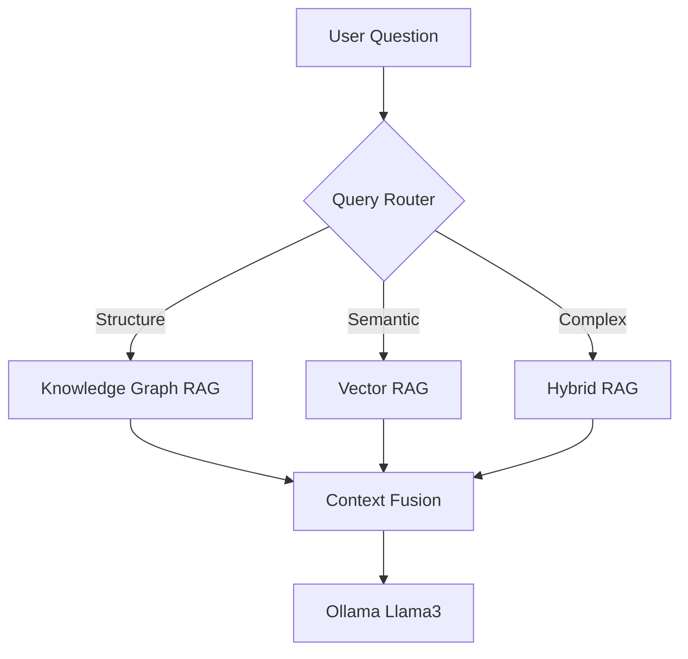

# IPO Intelligence Platform 🚀

A robust **Hybrid RAG (Retrieval-Augmented Generation)** system analyzing IPO prospectus documents using both **Knowledge Graphs** and **Vector Embeddings**.

Built with Flask, NetworkX, SentenceTransformers, and Ollama (Llama 3).


## 🌟 Key Features

*   **Hybrid RAG Architecture**: Intelligently combines:
    *   **Knowledge Graph RAG**: For structured queries (e.g., "Who is the CEO?", "What are the subsidiaries?") using precise entity-relationship traversal.
    *   **Vector RAG**: For semantic queries (e.g., "What are the risk factors?") using embedding-based search.
    *   **Context Fusion**: Merges both sources for complex reasoning.
*   **Query Router**: Automatically classifies user questions to route them to the most efficient retrieval engine.
*   **Interactive Knowledge Graph**: Visualize relationships between entities in real-time.
*   **Local LLM Support**: Fully private execution using local Ollama models (Llama 3, DeepSeek).
*   **Streaming Responses**: Real-time token streaming for a responsive UI.

## 🏗️ System Architecture

The system uses a **Router-to-Solver** pattern to optimize for both accuracy and latency.



See [Detailed Architecture](docs/architecture_diagram.md) for deeper insights.

## 🚀 Getting Started

### Prerequisites

*   Python 3.10+
*   [Ollama](https://ollama.ai) installed and running
*   `llama3` model pulled (`ollama pull llama3`)

### Installation

1.  **Clone the repository**
    ```bash
    git clone https://github.com/yourusername/ipo-qa.git
    cd ipo-qa
    ```

2.  **Create a Virtual Environment**
    ```bash
    python3 -m venv venv
    source venv/bin/activate
    ```

3.  **Install Dependencies**
    ```bash
    pip install -r requirements.txt
    ```

    > **Note for Apple Silicon (M1/M2)**: If you encounter mutex lock errors with Torch, ensure you are running in a clean environment and let the requirements install the correct wheels.

### Running the Application

1.  **Start Ollama Server** (in a separate terminal)
    ```bash
    ollama serve
    ```

2.  **Start the Backend**
    ```bash
    ./start_server.sh
    ```
    The application will run on `http://localhost:5000`.

## 📂 Project Structure

```
ipo_qa/
├── src/                # Application Source Code
│   ├── app.py          # Main Flask Application
│   ├── utils/          # RAG Engines & Helpers
│   ├── static/         # Frontend Assets
│   └── templates/      # HTML Templates
├── scripts/            # Utility Scripts
│   ├── build_kg.py     # KG Extraction Pipeline
│   └── visualize_kg.py # Graph Visualization
├── evaluation/         # Benchmarking Tools
│   ├── evaluate_*.py   # Evaluation Scripts
│   └── data/           # Test Datasets
├── docs/               # Documentation
│   ├── architecture.md # Detailed Design
│   └── case_study.md   # Project Case Study
├── data/               # Processed Data (GitInored)
└── requirements.txt    # Dependencies
```

## 🧪 Evaluation

To run the benchmark suite:
```bash
python evaluation/evaluate_complex.py
```
This runs 10 complex reasoning questions against KG, Vector, and Hybrid modes to compare performance.

## 📝 License

MIT License. See [LICENSE](LICENSE) for details.
