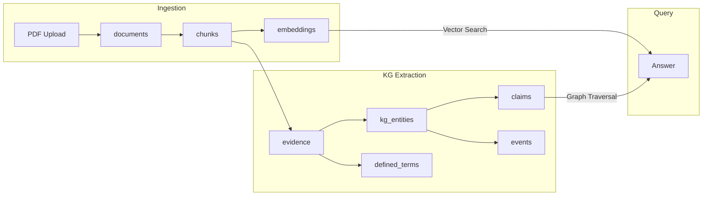
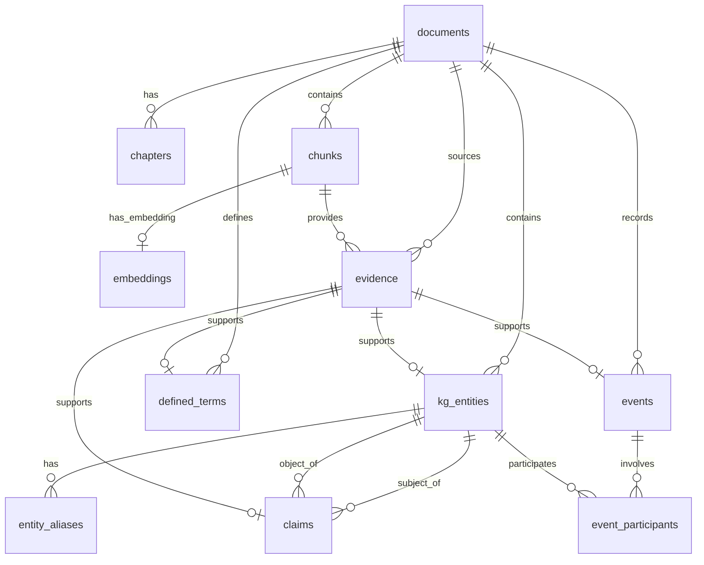

# IPO Intelligence Platform - Database Schema

## Overview

PostgreSQL database with **pgvector** extension for semantic search. Two schema layers:
1. **Core Schema** - Documents, chunks, embeddings (existing)
2. **KG Schema** - Entities, claims, events, evidence (new)

---

## Data Flow



---

## Core Tables

### `documents`
| Column | Type | Description |
|--------|------|-------------|
| `id` | SERIAL PK | Internal ID |
| `document_id` | VARCHAR(255) | Unique identifier (e.g., `policybazar_ipo`) |
| `filename` | VARCHAR(255) | Original filename |
| `display_name` | VARCHAR(255) | Human-readable name |
| `file_hash` | VARCHAR(64) | MD5 hash for deduplication |
| `file_path` | TEXT | Path to PDF file |
| `total_pages` | INTEGER | Number of pages |
| `total_chunks` | INTEGER | Number of text chunks |
| `upload_date` | TIMESTAMP | When uploaded |
| `processed_at` | TIMESTAMP | When processing completed |
| `metadata` | JSONB | Flexible metadata |

---

### `chapters`
| Column | Type | Description |
|--------|------|-------------|
| `id` | SERIAL PK | Internal ID |
| `document_id` | FK → documents | Parent document |
| `chapter_number` | INTEGER | Chapter order |
| `title` | VARCHAR(500) | Chapter title |
| `start_page` | INTEGER | First page |
| `end_page` | INTEGER | Last page |

---

### `chunks`
| Column | Type | Description |
|--------|------|-------------|
| `id` | SERIAL PK | Chunk ID |
| `document_id` | FK → documents | Parent document |
| `chapter_id` | FK → chapters | Parent chapter (nullable) |
| `chunk_index` | INTEGER | Order within document |
| `text` | TEXT | Chunk text content |
| `page_number` | INTEGER | Source page |
| `word_count` | INTEGER | Number of words |
| `metadata` | JSONB | Extra metadata |

---

### `embeddings`
| Column | Type | Description |
|--------|------|-------------|
| `id` | SERIAL PK | Embedding ID |
| `chunk_id` | FK → chunks | Parent chunk |
| `embedding` | VECTOR(384) | all-MiniLM-L6-v2 embedding |
| `model_name` | VARCHAR(100) | Model used |

**Index:** HNSW for fast cosine similarity search

---

## KG Tables (New)

### `evidence`
Provenance tracking for every extracted fact.

| Column | Type | Description |
|--------|------|-------------|
| `id` | SERIAL PK | Evidence ID |
| `document_id` | FK → documents | Source document |
| `chunk_id` | FK → chunks | Source chunk |
| `quote` | TEXT | Direct quote (≤25 words) |
| `page_number` | INTEGER | Page in PDF |
| `section_title` | VARCHAR(255) | Section heading |

---

### `kg_entities`
Canonical entities extracted from documents.

| Column | Type | Description |
|--------|------|-------------|
| `id` | SERIAL PK | Entity ID |
| `document_id` | FK → documents | Source document |
| `entity_type` | VARCHAR(50) | Company, Person, Regulator, etc. |
| `canonical_name` | VARCHAR(500) | Official name |
| `normalized_key` | VARCHAR(500) | Lowercase, underscored (for matching) |
| `attributes` | JSONB | CIN, DIN, address, etc. |
| `confidence` | FLOAT | Extraction confidence (0-1) |
| `evidence_id` | FK → evidence | Source evidence |

---

### `entity_aliases`
Name variants for entity resolution.

| Column | Type | Description |
|--------|------|-------------|
| `id` | SERIAL PK | Alias ID |
| `entity_id` | FK → kg_entities | Parent entity |
| `alias` | VARCHAR(500) | Alternate name |
| `alias_normalized` | VARCHAR(500) | Normalized form |
| `source` | VARCHAR(50) | How discovered |

---

### `defined_terms`
Glossary definitions from DRHP.

| Column | Type | Description |
|--------|------|-------------|
| `id` | SERIAL PK | Term ID |
| `document_id` | FK → documents | Source document |
| `term` | VARCHAR(500) | Defined term |
| `term_normalized` | VARCHAR(500) | Normalized form |
| `definition` | TEXT | Definition text |
| `evidence_id` | FK → evidence | Source evidence |

---

### `claims`
Facts as subject-predicate-object triples.

| Column | Type | Description |
|--------|------|-------------|
| `id` | SERIAL PK | Claim ID |
| `document_id` | FK → documents | Source document |
| `subject_entity_id` | FK → kg_entities | Subject entity |
| `predicate` | VARCHAR(100) | Relationship type |
| `object_value` | TEXT | Literal value (if not entity) |
| `object_entity_id` | FK → kg_entities | Object entity (if relationship) |
| `datatype` | VARCHAR(50) | string, number, date, entity |
| `period_label` | VARCHAR(50) | FY2021, Q1FY22, etc. |
| `period_scope` | VARCHAR(50) | consolidated, standalone |
| `confidence` | FLOAT | Extraction confidence |
| `evidence_id` | FK → evidence | Source evidence |

---

### `events`
Timeline events (name changes, appointments, etc.)

| Column | Type | Description |
|--------|------|-------------|
| `id` | SERIAL PK | Event ID |
| `document_id` | FK → documents | Source document |
| `event_type` | VARCHAR(100) | NameChange, Appointment, etc. |
| `event_date` | DATE | Parsed date (YYYY-MM-DD) |
| `event_date_text` | VARCHAR(100) | Original text |
| `description` | TEXT | Event description |
| `evidence_id` | FK → evidence | Source evidence |

---

### `event_participants`
Entities involved in events.

| Column | Type | Description |
|--------|------|-------------|
| `id` | SERIAL PK | ID |
| `event_id` | FK → events | Parent event |
| `entity_id` | FK → kg_entities | Participant entity |
| `role` | VARCHAR(100) | subject, acquirer, appointee |

---

## Entity-Relationship Diagram



---

## Key Indexes

| Index | Table | Purpose |
|-------|-------|---------|
| `idx_embeddings_vector` | embeddings | HNSW for similarity search |
| `idx_kg_entities_normalized` | kg_entities | Fast entity lookup |
| `idx_claims_predicate` | claims | Relationship queries |
| `idx_defined_terms_normalized` | defined_terms | Term lookup |

---

## Query Examples

### Vector Search (Semantic)
```sql
SELECT c.text, 1 - (e.embedding <=> query_vec) as similarity
FROM embeddings e
JOIN chunks c ON c.id = e.chunk_id
WHERE c.document_id = 123
ORDER BY e.embedding <=> query_vec
LIMIT 5;
```

### Entity Lookup
```sql
SELECT * FROM kg_entities
WHERE document_id = 123
  AND normalized_key = 'pb_fintech_limited';
```

### Relationship Traversal
```sql
-- Find all subsidiaries
SELECT obj.canonical_name 
FROM claims c
JOIN kg_entities subj ON subj.id = c.subject_entity_id
JOIN kg_entities obj ON obj.id = c.object_entity_id
WHERE subj.normalized_key = 'pb_fintech_limited'
  AND c.predicate = 'parent_of';
```

### Definition Lookup
```sql
SELECT term, definition 
FROM defined_terms
WHERE document_id = 123
  AND term_normalized ILIKE '%esop%';
```
