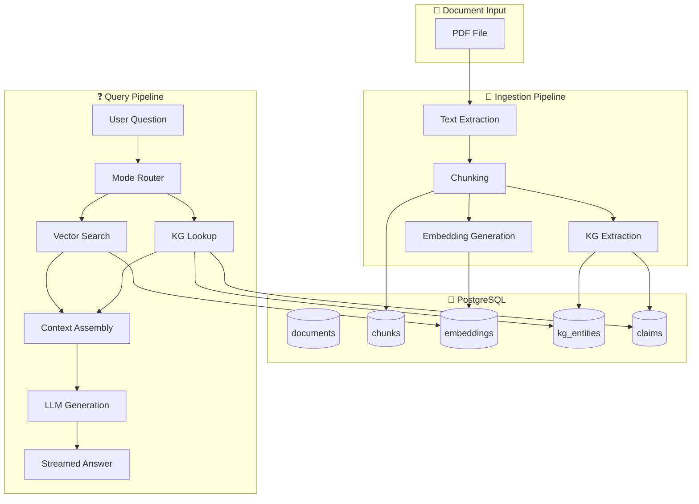
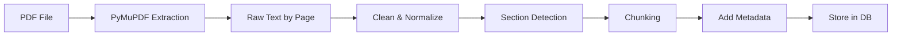
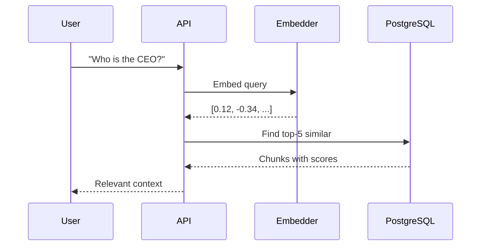
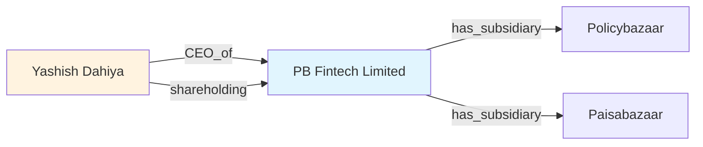
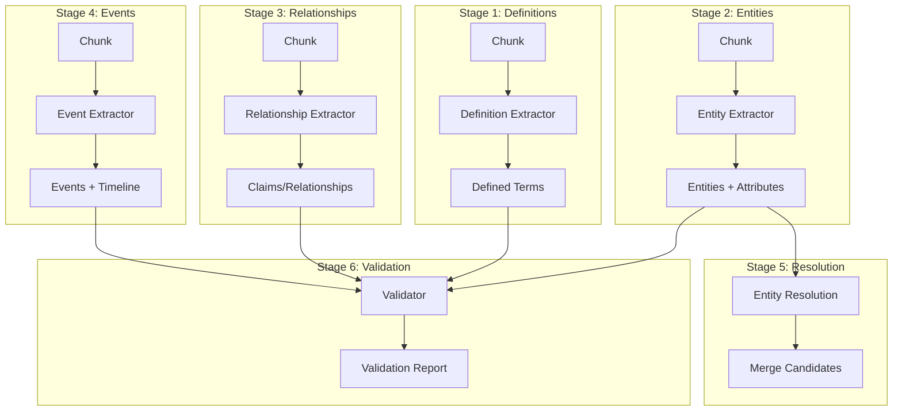
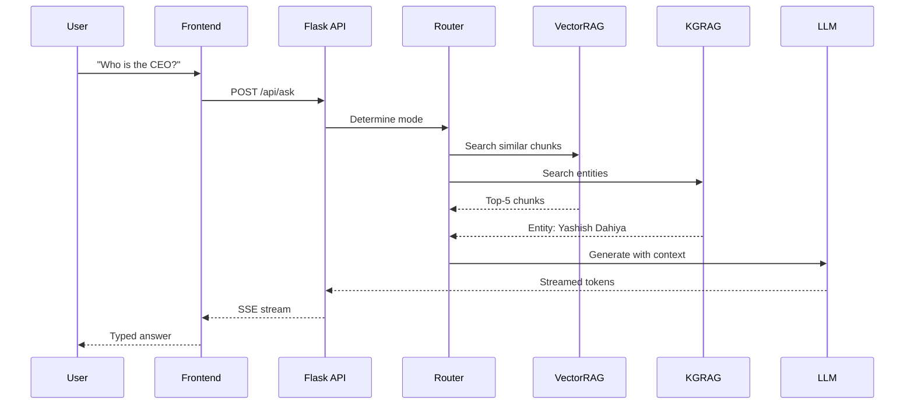
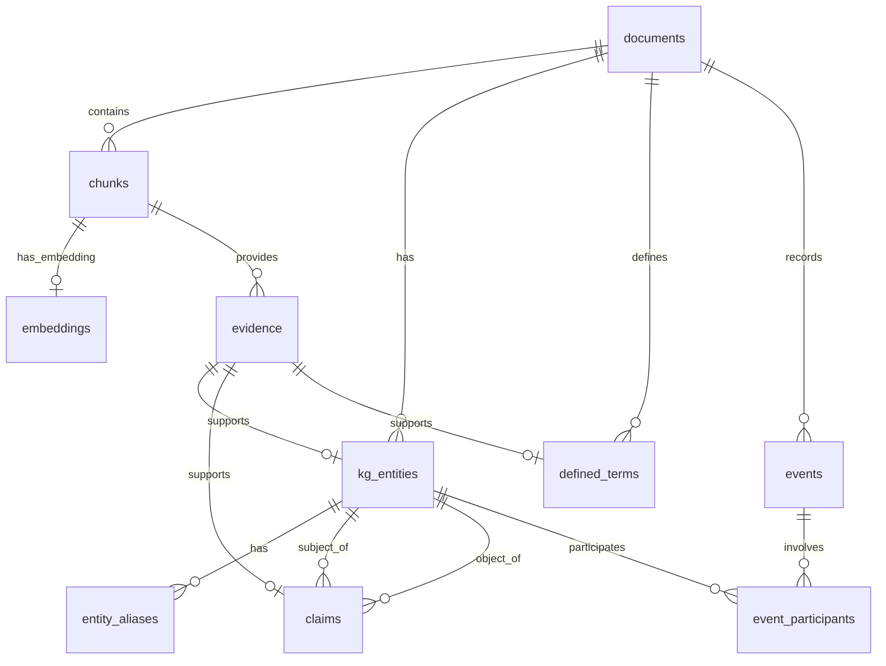
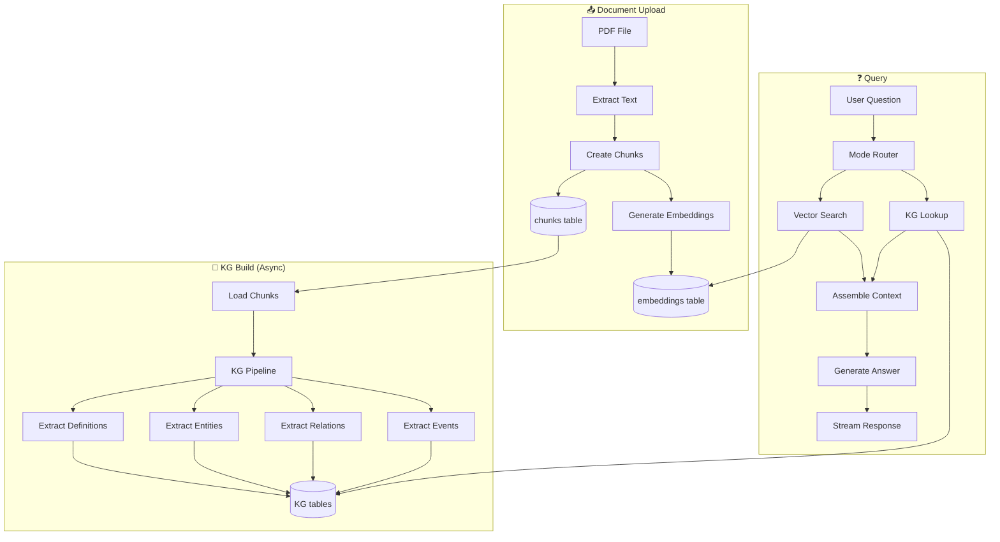

# IPO Intelligence Platform - Complete Technical Guide

> **A Deep Dive into Hybrid RAG: Combining Vector Search + Knowledge Graphs**
> 
> Version 2.0 | December 2024

---

# Table of Contents

1. [Executive Summary & Architecture](#chapter-1-executive-summary--architecture)
2. [PDF Ingestion & Chunking](#chapter-2-pdf-ingestion--chunking)
3. [Vector Embeddings & Semantic Search](#chapter-3-vector-embeddings--semantic-search)
4. [Knowledge Graph Generation](#chapter-4-knowledge-graph-generation)
5. [RAG Query Pipeline](#chapter-5-rag-query-pipeline)
6. [Database Schema Deep Dive](#chapter-6-database-schema-deep-dive)
7. [PostgreSQL Implementation Details](#chapter-7-postgresql-implementation-details)
8. [Frontend & API Layer](#chapter-8-frontend--api-layer)
9. [System Integration & Data Flow](#chapter-9-system-integration--data-flow)
10. [Interview Q&A Guide](#chapter-10-interview-qa-guide)

---

# Chapter 1: Executive Summary & Architecture

## 1.1 What is This Project?

The **IPO Intelligence Platform** is a production-grade document intelligence system that allows users to ask natural language questions about IPO prospectuses (DRHPs - Draft Red Herring Prospectuses) and get accurate, sourced answers.

### The Problem It Solves

IPO documents are:
- **Long**: 400-800+ pages
- **Dense**: Legal, financial, regulatory information
- **Structured**: Definitions, tables, timelines
- **Critical**: Investment decisions depend on accuracy

Traditional search fails because:
- Keyword search misses semantic meaning
- No understanding of relationships
- Can't answer "Who owns what?" type questions

### The Solution: Hybrid RAG

**RAG = Retrieval Augmented Generation**

Instead of asking an LLM to answer from memory (which hallucinates), RAG:
1. **Retrieves** relevant context from your documents
2. **Augments** the prompt with this context
3. **Generates** an answer grounded in facts

Our hybrid approach uses **two retrieval methods**:

| Method | Good For | How It Works |
|--------|----------|--------------|
| **Vector RAG** | Semantic similarity, "fuzzy" matches | Embeddings + cosine similarity |
| **KG RAG** | Exact facts, relationships, definitions | Graph traversal, entity lookup |

---

## 1.2 High-Level Architecture



---

## 1.3 Technology Stack

| Layer | Technology | Why This Choice |
|-------|------------|-----------------|
| **Backend** | Python + Flask | Fast development, ML ecosystem |
| **Database** | PostgreSQL + pgvector | Production-ready, vector search built-in |
| **Embeddings** | all-MiniLM-L6-v2 | Fast, 384 dims, good quality |
| **LLM** | Ollama (llama3) | Local, no API costs, privacy |
| **Frontend** | Vanilla JS + CSS | Simple, no build step needed |

---

## 1.4 Key Design Decisions

### Why PostgreSQL Instead of Vector DBs?

We chose PostgreSQL + pgvector over specialized vector databases (Pinecone, Weaviate, Qdrant) because:

1. **Single database for everything**: Vectors, metadata, KG all in one place
2. **ACID transactions**: Consistency for complex operations
3. **SQL power**: JOIN chunks with entities, filter by document
4. **Production proven**: PostgreSQL is battle-tested
5. **Cost**: Free, no SaaS fees

### Why Local LLM (Ollama)?

1. **Privacy**: IPO documents contain sensitive information
2. **Cost**: No API costs for extraction (we process 816 chunks per document!)
3. **Control**: No rate limits, no API changes
4. **Latency**: No network round-trips

### Why Hybrid RAG?

| Question Type | Vector RAG | KG RAG | Best Choice |
|---------------|------------|--------|-------------|
| "Tell me about the company" | ✅ Good | ❌ Too narrow | Vector |
| "Who is the CEO?" | ⚠️ May miss | ✅ Direct lookup | KG |
| "List all subsidiaries" | ❌ Scattered | ✅ Relationship query | KG |
| "What are the risks?" | ✅ Semantic match | ❌ Not structured | Vector |
| "Revenue in FY2021?" | ⚠️ Inconsistent | ✅ Typed query | KG |

**Hybrid gives us the best of both worlds.**

---

## 1.5 Project Structure

```
ipo_qa/
├── src/
│   ├── app.py                    # Flask application (API endpoints)
│   ├── database/
│   │   ├── connection.py         # PostgreSQL connection pool
│   │   ├── models.py             # SQLAlchemy ORM models
│   │   ├── repositories/         # Data access layer
│   │   ├── kg_models.py          # KG-specific models
│   │   └── kg_repositories.py    # KG data access
│   ├── utils/
│   │   ├── vector_rag.py         # Vector-based retrieval
│   │   ├── kg_rag.py             # Knowledge graph retrieval
│   │   ├── hybrid_rag.py         # Combined retrieval
│   │   ├── kg_pipeline.py        # KG extraction pipeline
│   │   ├── kg_prompts.py         # LLM prompts for extraction
│   │   └── deepseek_client.py    # Ollama client wrapper
│   └── static/
│       ├── index.html            # Main UI
│       ├── style.css             # Premium styling
│       └── script.js             # Frontend logic
├── scripts/
│   ├── build_kg.py               # Original KG builder
│   └── build_kg_v2.py            # New production KG builder
├── database/
│   ├── schema.sql                # Core tables
│   └── kg_schema.sql             # KG tables
├── data/
│   └── documents/
│       └── {document_id}/
│           ├── chunks.json       # Extracted chunks
│           ├── embeddings.npy    # Vector embeddings
│           └── knowledge_graph/  # KG files
└── docs/
    └── DATABASE_SCHEMA.md        # Schema documentation
```

---

# Chapter 2: PDF Ingestion & Chunking

## 2.1 The Problem: PDFs Are Messy

PDF files are designed for **display**, not data extraction. They contain:
- Text in arbitrary positions
- Tables that look aligned but aren't structured
- Headers/footers on every page
- Multi-column layouts
- Embedded images

### Our Extraction Pipeline



---

## 2.2 Text Extraction with PyMuPDF

We use [PyMuPDF](https://pymupdf.readthedocs.io/) (aka `fitz`) for extraction:

```python
import fitz  # PyMuPDF

def extract_text_from_pdf(pdf_path: str) -> List[Dict]:
    """Extract text from PDF, page by page."""
    doc = fitz.open(pdf_path)
    pages = []
    
    for page_num, page in enumerate(doc):
        text = page.get_text("text")  # Plain text extraction
        
        pages.append({
            'page_number': page_num + 1,
            'text': text,
            'word_count': len(text.split())
        })
    
    return pages
```

### Why PyMuPDF?

| Library | Speed | Accuracy | Table Support |
|---------|-------|----------|---------------|
| PyMuPDF | ⚡ Fast | ✅ Good | ⚠️ Basic |
| pdfplumber | 🐢 Slow | ✅ Good | ✅ Better |
| PyPDF2 | ⚡ Fast | ❌ Poor | ❌ None |

We chose PyMuPDF for speed. Table extraction is a known limitation (future improvement).

---

## 2.3 Chunking Strategy

### Why Chunk?

LLMs have **context limits** (4K-128K tokens). Even with large contexts:
- More text = slower inference
- More text = more noise
- Retrieval works better on focused chunks

### Our Chunking Parameters

| Parameter | Value | Why |
|-----------|-------|-----|
| **Chunk size** | 500-1200 tokens | Fits multiple chunks in context |
| **Overlap** | 100 tokens | Prevents splitting mid-sentence |
| **Split on** | Paragraphs, sections | Preserves coherence |

### Chunking Algorithm

```python
def chunk_document(text: str, max_tokens: int = 800, overlap: int = 100) -> List[str]:
    """Split document into overlapping chunks."""
    
    # Split into paragraphs first
    paragraphs = text.split('\n\n')
    
    chunks = []
    current_chunk = []
    current_tokens = 0
    
    for para in paragraphs:
        para_tokens = len(para.split())  # Approximate tokenization
        
        if current_tokens + para_tokens > max_tokens:
            # Save current chunk
            chunks.append('\n\n'.join(current_chunk))
            
            # Start new chunk with overlap
            overlap_text = current_chunk[-1] if current_chunk else ""
            current_chunk = [overlap_text, para]
            current_tokens = len(overlap_text.split()) + para_tokens
        else:
            current_chunk.append(para)
            current_tokens += para_tokens
    
    # Don't forget last chunk
    if current_chunk:
        chunks.append('\n\n'.join(current_chunk))
    
    return chunks
```

---

## 2.4 Section Detection

IPO documents have standard sections:
- Definitions
- Risk Factors
- Business Overview
- Financial Information
- Promoters & Management

We detect these using pattern matching:

```python
SECTION_PATTERNS = [
    (r'^DEFINITIONS', 'Definitions'),
    (r'^RISK FACTORS', 'Risk Factors'),
    (r'^OUR BUSINESS', 'Business'),
    (r'^FINANCIAL INFORMATION', 'Financials'),
    (r'^BOARD OF DIRECTORS', 'Management'),
]

def detect_section(text: str) -> Optional[str]:
    """Detect section from text beginning."""
    for pattern, section_name in SECTION_PATTERNS:
        if re.match(pattern, text.strip(), re.IGNORECASE):
            return section_name
    return None
```

### Why Section Detection Matters

1. **Better retrieval**: Filter by section type
2. **KG extraction**: Different prompts for different sections
3. **User context**: Show where answer came from

---

## 2.5 Metadata Preservation

Each chunk stores:

```json
{
    "chunk_index": 42,
    "text": "The Company was incorporated as...",
    "page_number": 15,
    "section_title": "Business Overview",
    "word_count": 245,
    "metadata": {
        "chapter_name": "OUR BUSINESS",
        "page_start": 15,
        "page_end": 15
    }
}
```

This metadata is **critical** for:
- Showing source attribution to users
- Filtering retrieval by section
- KG extraction provenance

---

# Chapter 3: Vector Embeddings & Semantic Search

## 3.1 What Are Embeddings?

An **embedding** is a dense vector representation of text that captures semantic meaning.

```
"The CEO of the company" → [0.12, -0.34, 0.56, ..., 0.78]  # 384 numbers
"Chief Executive Officer" → [0.11, -0.33, 0.55, ..., 0.77]  # Similar!
"Revenue increased by 20%" → [0.89, 0.12, -0.45, ..., 0.23]  # Different
```

### Key Insight

Similar meanings → Similar vectors → Small distance

This lets us find relevant text even when words don't match exactly!

---

## 3.2 Our Embedding Model: all-MiniLM-L6-v2

| Property | Value |
|----------|-------|
| **Model** | sentence-transformers/all-MiniLM-L6-v2 |
| **Dimensions** | 384 |
| **Max tokens** | 256 |
| **Speed** | ~14,000 sentences/sec on CPU |
| **Quality** | Good for short texts |

### Why This Model?

1. **Fast**: Can embed 816 chunks in seconds
2. **Small**: 80MB model, runs locally
3. **384 dims**: Good balance of quality/storage
4. **Well-tested**: Industry standard for retrieval

---

## 3.3 Generating Embeddings

```python
from sentence_transformers import SentenceTransformer

class EmbeddingGenerator:
    def __init__(self, model_name: str = 'all-MiniLM-L6-v2'):
        self.model = SentenceTransformer(model_name)
    
    def embed_texts(self, texts: List[str]) -> np.ndarray:
        """Generate embeddings for a list of texts."""
        embeddings = self.model.encode(
            texts,
            convert_to_numpy=True,
            show_progress_bar=True,
            normalize_embeddings=True  # For cosine similarity
        )
        return embeddings  # Shape: (num_texts, 384)
    
    def embed_query(self, query: str) -> np.ndarray:
        """Generate embedding for a single query."""
        return self.model.encode(
            query,
            convert_to_numpy=True,
            normalize_embeddings=True
        )
```

### Normalization

We normalize embeddings so that:
- Cosine similarity = Dot product
- Faster computation
- Values between -1 and 1

---

## 3.4 Storing Embeddings in PostgreSQL (pgvector)

### The pgvector Extension

pgvector adds native vector support to PostgreSQL:

```sql
-- Enable extension
CREATE EXTENSION IF NOT EXISTS vector;

-- Create table with vector column
CREATE TABLE embeddings (
    id SERIAL PRIMARY KEY,
    chunk_id INTEGER REFERENCES chunks(id),
    embedding vector(384) NOT NULL,  -- 384-dimensional vector
    model_name VARCHAR(100)
);
```

### Indexing for Fast Search

Without an index, vector search is O(n) - check every vector.

With **HNSW** (Hierarchical Navigable Small World) index:

```sql
CREATE INDEX idx_embeddings_vector ON embeddings 
USING hnsw (embedding vector_cosine_ops)
WITH (m = 16, ef_construction = 64);
```

| Parameter | Meaning |
|-----------|---------|
| `m = 16` | Max connections per node |
| `ef_construction = 64` | Build-time search depth |
| `vector_cosine_ops` | Use cosine distance |

**Result**: Search is O(log n) - milliseconds even with millions of vectors!

---

## 3.5 Semantic Search: Finding Similar Chunks

### The Query Process



### The SQL Query

```sql
SELECT 
    c.id,
    c.text,
    c.page_number,
    1 - (e.embedding <=> $1) as similarity  -- Cosine similarity
FROM embeddings e
JOIN chunks c ON c.id = e.chunk_id
JOIN documents d ON d.id = c.document_id
WHERE d.document_id = $2
ORDER BY e.embedding <=> $1  -- Distance operator
LIMIT 5;
```

### Distance Operators in pgvector

| Operator | Meaning | Use Case |
|----------|---------|----------|
| `<=>` | Cosine distance | Normalized vectors (our case) |
| `<->` | L2 (Euclidean) | Absolute positions |
| `<#>` | Inner product | Un-normalized vectors |

---

## 3.6 VectorRAG Implementation

```python
class VectorRAG:
    """Vector-based Retrieval Augmented Generation."""
    
    def __init__(self, doc_folder: str, document_id: str):
        self.document_id = document_id
        self.embedder = SentenceTransformer('all-MiniLM-L6-v2')
    
    def query(self, question: str, top_k: int = 5) -> List[Dict]:
        """Find most relevant chunks for a question."""
        
        # 1. Embed the question
        query_embedding = self.embedder.encode(
            question, 
            normalize_embeddings=True
        )
        
        # 2. Search PostgreSQL
        with get_db() as db:
            result = db.execute(text("""
                SELECT 
                    c.text,
                    c.page_number,
                    1 - (e.embedding <=> :query_vec) as similarity
                FROM embeddings e
                JOIN chunks c ON c.id = e.chunk_id
                JOIN documents d ON d.id = c.document_id
                WHERE d.document_id = :doc_id
                ORDER BY e.embedding <=> :query_vec
                LIMIT :top_k
            """), {
                'query_vec': query_embedding.tolist(),
                'doc_id': self.document_id,
                'top_k': top_k
            })
            
            chunks = []
            for row in result:
                chunks.append({
                    'text': row.text,
                    'page': row.page_number,
                    'score': float(row.similarity)
                })
        
        return chunks
```

---

## 3.7 Similarity Thresholds

Not all results are useful. We filter by score:

| Score | Meaning | Action |
|-------|---------|--------|
| > 0.7 | High relevance | Include |
| 0.5 - 0.7 | Maybe relevant | Include with caution |
| < 0.5 | Low relevance | Usually discard |

```python
def filter_by_relevance(chunks: List[Dict], threshold: float = 0.5) -> List[Dict]:
    """Filter chunks by similarity score."""
    return [c for c in chunks if c['score'] >= threshold]
```

---

# Chapter 4: Knowledge Graph Generation

## 4.1 Why Knowledge Graphs?

Vector search is powerful but has limitations:

| Vector Search Problem | KG Solution |
|----------------------|-------------|
| "Who is the CEO?" might return pages about CEOs generally | Direct entity lookup |
| Multiple mentions scattered across chunks | Single canonical entity |
| Can't follow relationships | Graph traversal |
| No structured data | Typed attributes |

### What is a Knowledge Graph?

A **Knowledge Graph** represents information as:
- **Entities**: Things (People, Companies, Events)
- **Attributes**: Properties of entities (name, CIN, date)
- **Relationships**: Connections between entities (CEO_of, subsidiary_of)



---

## 4.2 KG Extraction Pipeline (v2.0)

Our pipeline has 6 stages:



---

## 4.3 Stage 1: Definition Extraction

IPO documents have a "Definitions" section. This is gold for KG!

### Example Input

```
"ESOP – 2014" shall mean the employee stock option plan of our Company 
approved on October 8, 2014, as amended from time to time.
```

### Extraction Prompt

```python
DEFINITIONS_PROMPT = """Extract defined terms from this IPO document text.

TEXT:
{chunk_text}

Look for patterns:
- "X" means/refers to...
- "X" shall mean...

OUTPUT (strict JSON):
{
  "defined_terms": [
    {
      "term": "ESOP – 2014",
      "definition": "the employee stock option plan of our Company...",
      "evidence": {
        "quote": "ESOP – 2014 shall mean the employee stock option plan",
        "page": 15
      }
    }
  ]
}
"""
```

### Output

```json
{
  "term": "ESOP – 2014",
  "term_normalized": "esop_2014",
  "definition": "the employee stock option plan of our Company approved on October 8, 2014",
  "evidence_id": 42
}
```

---

## 4.4 Stage 2: Entity + Attribute Extraction

### Entity Types We Extract

| Type | Examples | Key Attributes |
|------|----------|----------------|
| Company | PB Fintech Limited, Policybazaar | CIN, incorporation_date, address |
| Person | Yashish Dahiya, Alok Bansal | DIN, designation, shareholding |
| Regulator | SEBI, RBI, IRDAI | - |
| Exchange | BSE, NSE | - |
| Auditor | Deloitte, KPMG | - |
| Security | Equity Shares | face_value, issue_price |

### Extraction Example

**Input:**
```
Mr. Yashish Dahiya, the Chairman, Executive Director and Chief Executive 
Officer of our Company, holds 17,545,000 equity shares representing 4.27% stake.
```

**Output:**
```json
{
  "entities": [
    {
      "name": "Yashish Dahiya",
      "type": "Person",
      "normalized_key": "yashish_dahiya",
      "attributes": {
        "designation": "Chairman, Executive Director and CEO",
        "shares_held": 17545000,
        "percentage": 4.27
      },
      "evidence": {
        "quote": "Mr. Yashish Dahiya... holds 17,545,000 equity shares representing 4.27%",
        "page": 23
      }
    }
  ]
}
```

---

## 4.5 Stage 3: Relationship Extraction

### Relationship Types

| Predicate | Subject → Object | Example |
|-----------|------------------|---------|
| `subsidiary_of` | Company → Company | Policybazaar → PB Fintech |
| `promoter_of` | Person → Company | Yashish Dahiya → PB Fintech |
| `ceo_of` | Person → Company | Yashish Dahiya → PB Fintech |
| `auditor_of` | Company → Company | Deloitte → PB Fintech |
| `shareholder_of` | Person/Company → Company | With percentage |

### How It Works

```python
RELATIONSHIP_PROMPT = """Extract relationships between entities.

TEXT: {chunk_text}

KNOWN ENTITIES: {entity_list}

OUTPUT:
{
  "relationships": [
    {
      "subject": "Yashish Dahiya",
      "predicate": "ceo_of",
      "object": "PB Fintech Limited",
      "attributes": {"effective_date": "2021-01-01"},
      "evidence": {"quote": "...", "page": 23}
    }
  ]
}
"""
```

---

## 4.6 Stage 4: Event Extraction

### Event Types

| Type | Example |
|------|---------|
| `Incorporation` | Company founded on July 12, 2008 |
| `NameChange` | Changed from XYZ Pvt Ltd to ABC Ltd |
| `Appointment` | Mr. X appointed as Director |
| `Acquisition` | Company acquired ABC for ₹100 Cr |
| `IPO_Filing` | DRHP filed with SEBI |

### Timeline Building

Events create a timeline:

```
2008-07-12: Incorporation of Eatigo Technologies
2014-10-08: ESOP-2014 approved
2019-04-15: Name changed to PB Fintech Private Limited
2021-07-31: DRHP filed with SEBI
2021-11-01: Listed on BSE and NSE
```

---

## 4.7 Stage 5: Entity Resolution

The same entity may appear with different names:
- "PB Fintech Limited"
- "PB Fintech"
- "the Company"
- "our Company"

### Resolution Logic

```python
def find_duplicates(entities: List[Dict]) -> List[Tuple]:
    """Find entities that might be the same."""
    candidates = []
    
    for i, e1 in enumerate(entities):
        for e2 in entities[i+1:]:
            # Same CIN = definitely same
            if e1.get('attributes', {}).get('cin') == e2.get('attributes', {}).get('cin'):
                candidates.append((e1, e2, 1.0, 'same_cin'))
            
            # Name containment
            elif e1['name'].lower() in e2['name'].lower():
                candidates.append((e1, e2, 0.8, 'name_contains'))
    
    return candidates
```

---

## 4.8 Stage 6: Validation

### Validation Rules

| Rule | Check | Severity |
|------|-------|----------|
| `required_fields` | Entity has name, type | ERROR |
| `valid_type` | Type in allowed list | ERROR |
| `quote_length` | ≤ 25 words | WARN |
| `percentage_range` | 0-100 | ERROR |
| `date_sanity` | 1900-2030 | WARN |

### Validation Report

```json
{
  "total_entities": 45,
  "total_claims": 120,
  "violations": [
    {"rule": "percentage_range", "entity": "XYZ", "value": 150}
  ],
  "is_valid": false
}
```

---

## 4.9 Evidence & Provenance

**Every extracted fact has evidence:**

```sql
CREATE TABLE evidence (
    id SERIAL PRIMARY KEY,
    chunk_id INTEGER REFERENCES chunks(id),
    quote TEXT NOT NULL,       -- ≤25 words from source
    page_number INTEGER,
    section_title VARCHAR(255)
);
```

This allows us to:
1. Show users where information came from
2. Verify extraction accuracy
3. Debug issues

---

# Chapter 5: RAG Query Pipeline

## 5.1 Query Flow Overview



---

## 5.2 Mode Selection

### Available Modes

| Mode | Description | When to Use |
|------|-------------|-------------|
| `vector` | Vector search only | Semantic questions |
| `kg` | KG lookup only | Fact-based questions |
| `hybrid` | Both combined | Default |
| `auto` | System decides | Not implemented yet |

### Graceful Fallback

If KG is not available for a document:

```python
kg_available = check_kg_availability(document_id)

if rag_mode in ['kg', 'hybrid'] and not kg_available:
    # Fallback to vector-only
    yield {"type": "warning", "msg": "KG not available, using Vector search"}
    rag_mode = 'vector'
```

---

## 5.3 Vector Retrieval

```python
def vector_query(question: str, document_id: str, top_k: int = 5):
    """Retrieve relevant chunks using vector similarity."""
    
    # Embed question
    query_vec = embedder.encode(question, normalize_embeddings=True)
    
    # Search PostgreSQL
    results = search_similar_chunks(query_vec, document_id, top_k)
    
    # Format as context
    context = "\n\n".join([
        f"[Page {r.page}]: {r.text}" 
        for r in results
    ])
    
    return context
```

---

## 5.4 KG Retrieval

```python
def kg_query(question: str, document_id: str):
    """Retrieve structured data from Knowledge Graph."""
    
    # Extract entities from question
    entities_mentioned = extract_entities_from_question(question)
    
    # Lookup in KG
    context_parts = []
    
    for entity_name in entities_mentioned:
        entity = KGEntityRepository.search(document_id, entity_name)
        
        if entity:
            # Get attributes
            context_parts.append(f"Entity: {entity['canonical_name']}")
            context_parts.append(f"Type: {entity['entity_type']}")
            
            # Get relationships
            claims = ClaimRepository.get_claims_for_entity(entity['id'])
            for claim in claims:
                context_parts.append(f"- {claim['predicate']}: {claim['object_value']}")
    
    return "\n".join(context_parts)
```

---

## 5.5 Hybrid Retrieval

```python
class HybridRAG:
    """Combine Vector and KG retrieval."""
    
    def __init__(self, kg_rag, vector_rag):
        self.kg_rag = kg_rag
        self.vector_rag = vector_rag
    
    def query(self, question: str) -> Dict:
        # Get both contexts
        vector_context = self.vector_rag.query(question)
        kg_context = self.kg_rag.query(question)
        
        # Combine
        combined = f"""
KNOWLEDGE GRAPH FACTS:
{kg_context}

RELEVANT DOCUMENT SECTIONS:
{vector_context}
"""
        return combined
```

---

## 5.6 Context Assembly

Before sending to LLM, we assemble context:

```python
def assemble_context(vector_chunks: List, kg_data: Dict) -> str:
    """Create final context for LLM."""
    
    context = []
    
    # Add KG facts first (most reliable)
    if kg_data.get('entities'):
        context.append("## Verified Facts from Knowledge Graph\n")
        for entity in kg_data['entities']:
            context.append(f"- {entity['name']}: {entity['type']}")
    
    # Add vector chunks
    context.append("\n## Relevant Document Excerpts\n")
    for chunk in vector_chunks:
        context.append(f"[Page {chunk['page']}] {chunk['text'][:500]}...")
    
    return "\n".join(context)
```

---

## 5.7 LLM Generation (Streaming)

```python
def generate_answer(question: str, context: str):
    """Generate answer using Ollama with streaming."""
    
    prompt = f"""You are an IPO document analyst. Answer based ONLY on the provided context.

CONTEXT:
{context}

QUESTION: {question}

ANSWER:"""
    
    # Stream from Ollama
    response = ollama.chat(
        model='llama3',
        messages=[{'role': 'user', 'content': prompt}],
        stream=True
    )
    
    for chunk in response:
        token = chunk['message']['content']
        yield {"type": "token", "content": token}
    
    yield {"type": "done"}
```

---

## 5.8 Streaming Protocol

We use **Server-Sent Events (SSE)** pattern with JSON:

```javascript
// Frontend receives:
{"type": "status", "msg": "Searching documents..."}
{"type": "status", "msg": "Found 5 relevant chunks"}
{"type": "token", "content": "The"}
{"type": "token", "content": " CEO"}
{"type": "token", "content": " is"}
{"type": "token", "content": " Yashish"}
{"type": "done"}
```

---

# Chapter 6: Database Schema Deep Dive

## 6.1 Schema Overview



---

## 6.2 Core Tables

### documents

```sql
CREATE TABLE documents (
    id SERIAL PRIMARY KEY,
    document_id VARCHAR(255) UNIQUE NOT NULL,  -- e.g., 'policybazar_ipo'
    filename VARCHAR(255) NOT NULL,             -- Original filename
    display_name VARCHAR(255) NOT NULL,         -- Human-readable
    file_hash VARCHAR(64) UNIQUE NOT NULL,      -- MD5 for dedup
    total_pages INTEGER DEFAULT 0,
    total_chunks INTEGER DEFAULT 0,
    upload_date TIMESTAMP DEFAULT NOW(),
    metadata JSONB DEFAULT '{}'
);
```

### chunks

```sql
CREATE TABLE chunks (
    id SERIAL PRIMARY KEY,
    document_id INTEGER REFERENCES documents(id) ON DELETE CASCADE,
    chunk_index INTEGER NOT NULL,
    text TEXT NOT NULL,
    page_number INTEGER,
    word_count INTEGER,
    metadata JSONB DEFAULT '{}',
    
    UNIQUE (document_id, chunk_index)
);
```

### embeddings

```sql
CREATE TABLE embeddings (
    id SERIAL PRIMARY KEY,
    chunk_id INTEGER REFERENCES chunks(id) ON DELETE CASCADE,
    embedding vector(384) NOT NULL,             -- pgvector type
    model_name VARCHAR(100) DEFAULT 'all-MiniLM-L6-v2'
);

-- HNSW index for fast similarity search
CREATE INDEX idx_embeddings_vector ON embeddings 
USING hnsw (embedding vector_cosine_ops);
```

---

## 6.3 KG Tables

### kg_entities

```sql
CREATE TABLE kg_entities (
    id SERIAL PRIMARY KEY,
    document_id INTEGER REFERENCES documents(id) ON DELETE CASCADE,
    entity_type VARCHAR(50) NOT NULL,           -- Company, Person, etc.
    canonical_name VARCHAR(500) NOT NULL,       -- Official name
    normalized_key VARCHAR(500) NOT NULL,       -- For matching
    attributes JSONB DEFAULT '{}',              -- CIN, DIN, etc.
    confidence FLOAT DEFAULT 1.0,
    evidence_id INTEGER REFERENCES evidence(id),
    
    UNIQUE(document_id, normalized_key)
);
```

### claims (Relationships & Facts)

```sql
CREATE TABLE claims (
    id SERIAL PRIMARY KEY,
    document_id INTEGER REFERENCES documents(id),
    subject_entity_id INTEGER REFERENCES kg_entities(id),
    predicate VARCHAR(100) NOT NULL,            -- ceo_of, subsidiary_of
    object_value TEXT,                          -- For literal values
    object_entity_id INTEGER REFERENCES kg_entities(id),  -- For relationships
    datatype VARCHAR(50) NOT NULL,              -- string, number, entity
    period_label VARCHAR(50),                   -- FY2021, Q1FY22
    confidence FLOAT DEFAULT 1.0,
    evidence_id INTEGER REFERENCES evidence(id)
);
```

### evidence (Provenance)

```sql
CREATE TABLE evidence (
    id SERIAL PRIMARY KEY,
    document_id INTEGER REFERENCES documents(id),
    chunk_id INTEGER REFERENCES chunks(id),
    quote TEXT NOT NULL,                        -- ≤25 words
    page_number INTEGER,
    section_title VARCHAR(255)
);
```

---

## 6.4 Indexes Explained

| Index | Table | Purpose | Type |
|-------|-------|---------|------|
| `idx_embeddings_vector` | embeddings | Similarity search | HNSW |
| `idx_kg_entities_normalized` | kg_entities | Entity lookup | B-tree |
| `idx_claims_predicate` | claims | Filter by relationship | B-tree |
| `idx_chunks_document` | chunks | Filter by document | B-tree |

### Why HNSW?

**HNSW** (Hierarchical Navigable Small World) is a graph-based index:

```
                    [Layer 2 - sparse]
                         ↓
                  [Layer 1 - medium]
                         ↓
              [Layer 0 - all vectors]
```

- Search starts at top (sparse) layer
- Navigates down to find approximate neighbors
- O(log n) instead of O(n)

---

# Chapter 7: PostgreSQL Implementation Details

## 7.1 Connection Pooling

```python
from sqlalchemy import create_engine
from sqlalchemy.orm import sessionmaker, scoped_session

DATABASE_URL = 'postgresql://localhost/ipo_intelligence'

engine = create_engine(
    DATABASE_URL,
    pool_size=10,          # Keep 10 connections ready
    max_overflow=20,       # Can grow to 30 under load
    pool_pre_ping=True     # Check connection before use
)

SessionLocal = scoped_session(
    sessionmaker(autocommit=False, autoflush=False, bind=engine)
)
```

### Why Connection Pooling?

- Creating connections is **expensive** (~50ms each)
- Reusing connections = **fast queries**
- `pool_pre_ping` prevents stale connection errors

---

## 7.2 Vector Search Query Explained

```sql
SELECT 
    c.id,
    c.text,
    c.page_number,
    1 - (e.embedding <=> $1) as similarity
FROM embeddings e
JOIN chunks c ON c.id = e.chunk_id
JOIN documents d ON d.id = c.document_id
WHERE d.document_id = $2
ORDER BY e.embedding <=> $1
LIMIT 5;
```

### Breaking It Down

| Part | Meaning |
|------|---------|
| `e.embedding <=> $1` | Cosine distance between stored and query vector |
| `1 - distance` | Convert distance to similarity (higher = better) |
| `JOIN chunks` | Get text for each matching embedding |
| `WHERE d.document_id` | Filter to specific document |
| `ORDER BY distance` | Closest first |
| `LIMIT 5` | Top 5 results |

---

## 7.3 Full-Text Search (Bonus)

PostgreSQL also supports full-text search for keyword matching:

```sql
-- Add tsvector column
ALTER TABLE chunks ADD COLUMN text_search tsvector;

-- Generate tsvector
UPDATE chunks SET text_search = to_tsvector('english', text);

-- Create GIN index
CREATE INDEX idx_chunks_text_search ON chunks USING gin(text_search);

-- Search
SELECT * FROM chunks 
WHERE text_search @@ plainto_tsquery('english', 'revenue growth');
```

### When to Use Full-Text vs Vector?

| Use Case | Full-Text | Vector |
|----------|-----------|--------|
| Exact keyword | ✅ | ❌ |
| Semantic match | ❌ | ✅ |
| Typo tolerance | ❌ | ✅ |
| Speed | ⚡ Faster | 🐢 Slower |

---

## 7.4 Transaction Handling

```python
@contextmanager
def get_db():
    """Context manager for database sessions."""
    db = SessionLocal()
    try:
        yield db
        db.commit()      # Commit on success
    except Exception as e:
        db.rollback()    # Rollback on error
        raise e
    finally:
        db.close()       # Always close
```

### Why This Pattern?

1. **Automatic commit**: No forgotten commits
2. **Automatic rollback**: Data consistency on errors
3. **Connection returned to pool**: No leaks

---

## 7.5 Bulk Insert Performance

For KG extraction, we insert many rows:

```python
# SLOW: One insert at a time
for entity in entities:
    db.execute(insert(Entity).values(entity))
    db.commit()  # Commit per row = slow!

# FAST: Batch insert
db.execute(insert(Entity), entities)  # Single statement
db.commit()  # One commit
```

**Performance difference**: 100x faster for large batches!

---

# Chapter 8: Frontend & API Layer

## 8.1 API Endpoints

| Endpoint | Method | Purpose |
|----------|--------|---------|
| `/api/documents` | GET | List all documents |
| `/api/upload` | POST | Upload new PDF |
| `/api/ask` | POST | Ask a question |
| `/` | GET | Serve frontend |

---

## 8.2 Document List API

```python
@app.route('/api/documents', methods=['GET'])
def list_documents():
    """Get all documents with KG availability."""
    documents = DocumentRepository.get_all()
    
    # Add KG availability flag
    for doc in documents:
        doc['has_kg'] = check_kg_availability(doc['document_id'])
    
    return jsonify({'documents': documents})
```

**Response:**
```json
{
  "documents": [
    {
      "document_id": "policybazar_ipo",
      "display_name": "PolicyBazaar IPO DRHP",
      "total_pages": 431,
      "has_kg": true
    }
  ]
}
```

---

## 8.3 Question API (Streaming)

```python
@app.route('/api/ask', methods=['POST'])
def ask_question():
    """Answer a question about a document."""
    
    data = request.json
    question = data['question']
    document_id = data['document_id']
    rag_mode = data.get('rag_mode', 'auto')
    
    def generate():
        # Status updates
        yield json.dumps({"type": "status", "msg": "Searching..."}) + "\n"
        
        # Get context
        context = retrieve_context(question, document_id, rag_mode)
        
        # Generate answer
        for token in generate_answer(question, context):
            yield json.dumps({"type": "token", "content": token}) + "\n"
        
        yield json.dumps({"type": "done"}) + "\n"
    
    return Response(
        stream_with_context(generate()),
        mimetype='application/x-ndjson'
    )
```

---

## 8.4 Frontend Architecture

```mermaid
flowchart TB
    subgraph UI["User Interface"]
        Input[Chat Input]
        Messages[Message Container]
        DocSelect[Document Selector]
    end
    
    subgraph JS["JavaScript Logic"]
        SendMsg[sendMessage]
        Stream[Stream Parser]
        Render[Markdown Renderer]
    end
    
    subgraph API["Flask Backend"]
        Ask[/api/ask]
    end
    
    Input --> SendMsg
    SendMsg --> Ask
    Ask --> Stream
    Stream --> Render
    Render --> Messages
```

---

## 8.5 Streaming in JavaScript

```javascript
async function sendMessage() {
    const question = document.getElementById('chatInput').value;
    
    const response = await fetch('/api/ask', {
        method: 'POST',
        headers: {'Content-Type': 'application/json'},
        body: JSON.stringify({
            question: question,
            document_id: currentDocumentId,
            rag_mode: 'auto'
        })
    });
    
    const reader = response.body.getReader();
    const decoder = new TextDecoder();
    
    while (true) {
        const {done, value} = await reader.read();
        if (done) break;
        
        const lines = decoder.decode(value).split('\n');
        for (const line of lines) {
            if (!line.trim()) continue;
            
            const data = JSON.parse(line);
            
            if (data.type === 'token') {
                displayText += data.content;
                updateDisplay(displayText);
            }
            else if (data.type === 'status') {
                showStatus(data.msg);
            }
        }
    }
}
```

---

# Chapter 9: System Integration & Data Flow

## 9.1 Complete Data Flow



---

## 9.2 Upload Flow Detail

1. **User uploads PDF** via drag-drop or file picker
2. **Calculate hash** for deduplication
3. **Extract text** using PyMuPDF
4. **Chunk** into 500-1200 token segments
5. **Generate embeddings** for each chunk
6. **Save to PostgreSQL**: document, chunks, embeddings
7. **Return** document info to frontend

```python
@app.route('/api/upload', methods=['POST'])
def upload_document():
    file = request.files['file']
    
    # 1. Save file
    filepath = save_upload(file)
    
    # 2. Check duplicate
    file_hash = get_file_hash(filepath)
    existing = DocumentRepository.get_by_hash(file_hash)
    if existing:
        return jsonify({'error': 'Duplicate', 'existing': existing}), 409
    
    # 3. Extract and process
    pages = extract_text_from_pdf(filepath)
    chunks = chunk_pages(pages)
    embeddings = generate_embeddings(chunks)
    
    # 4. Save to DB
    doc = DocumentRepository.create({...})
    ChunkRepository.create_many(chunks)
    EmbeddingRepository.create_many(embeddings)
    
    return jsonify({'document': doc})
```

---

## 9.3 Query Flow Detail

1. **User asks question**: "Who is the CEO?"
2. **Mode selection**: Auto/Vector/KG/Hybrid
3. **Vector retrieval**: 
   - Embed question
   - Search similar chunks in PostgreSQL
   - Return top-5 with scores
4. **KG retrieval**:
   - Extract entities from question
   - Lookup in kg_entities
   - Get related claims
5. **Combine context**: KG facts + Vector chunks
6. **LLM generation**: Ollama llama3 with streaming
7. **Stream to frontend**: Token by token

---

## 9.4 Error Handling

### Backend

```python
try:
    result = process_query(question)
except Exception as e:
    yield json.dumps({"type": "error", "msg": str(e)})
    return
```

### Frontend

```javascript
if (data.type === 'error') {
    showNotification(data.msg, 'error');
    displayError(data.msg);
}
```

---

# Chapter 10: Interview Q&A Guide

## 10.1 "Explain Your Project in 2 Minutes"

> "I built an IPO document intelligence platform that lets users ask natural language questions about IPO prospectuses and get accurate, sourced answers.
>
> The system uses a **hybrid RAG architecture** combining:
> 1. **Vector search** for semantic similarity using pgvector in PostgreSQL
> 2. **Knowledge Graph** for structured facts like entity relationships and definitions
>
> When a user asks 'Who is the CEO?', the system searches both the vector index and the KG, combines the context, and generates an answer using a local LLM.
>
> Key technical decisions:
> - PostgreSQL for everything (vectors + KG) instead of separate vector DBs
> - Local LLM (Ollama) for privacy and cost
> - Streaming responses for better UX
>
> The KG extraction uses a multi-stage pipeline with specialized prompts for definitions, entities, relationships, and events."

---

## 10.2 "Why Use Both Vector and KG?"

> "Vector search is great for semantic similarity - 'Tell me about the company's business' will find relevant paragraphs even if they don't contain exact keywords.
>
> But vector search struggles with:
> - Exact facts: 'What is the CIN number?' might return pages mentioning CIN but not the specific value
> - Relationships: 'List all subsidiaries' requires following connections
> - Definitions: 'What does ESOP-2014 mean?' needs exact definition lookup
>
> The KG complements this by storing structured data that can be queried precisely. When we combine both, we get the best of both worlds."

---

## 10.3 "How Does Chunking Affect Quality?"

> "Chunking is critical for retrieval quality. If chunks are:
>
> **Too small** (< 200 tokens):
> - Lose context
> - Related info split across chunks
> - Need more chunks to answer
>
> **Too large** (> 2000 tokens):
> - Dilute relevance
> - Include irrelevant text
> - Hit context limits faster
>
> We use **500-1200 tokens** with **100 token overlap** as a sweet spot. The overlap prevents cutting mid-sentence and helps maintain context across chunk boundaries.
>
> We also preserve section boundaries - a chunk from 'Risk Factors' won't include text from 'Business Overview'."

---

## 10.4 "What Challenges Did You Face?"

> "Several interesting challenges:
>
> 1. **KG extraction quality**: Initial prompts produced inconsistent output. Solved with specialized prompts per extraction type and strict JSON validation.
>
> 2. **Entity resolution**: Same entity appears with different names ('PB Fintech' vs 'the Company'). Built resolution logic using CIN matching and name similarity.
>
> 3. **Table extraction**: PDF tables are notoriously hard. PyMuPDF treats them as positioned text. This remains a limitation - we handle simple tables but complex ones need improvement.
>
> 4. **Streaming UX**: Getting smooth token-by-token display required careful buffer handling in both Python and JavaScript.
>
> 5. **Graceful degradation**: When KG is unavailable, we fall back to vector-only with a user warning instead of failing."

---

## 10.5 "How Would You Scale This?"

> "Several dimensions of scale:
>
> **More documents**:
> - PostgreSQL handles millions of rows easily
> - HNSW index scales to millions of vectors
> - Partition by document_id if needed
>
> **More users**:
> - Flask + Gunicorn with multiple workers
> - Connection pooling (already implemented)
> - Redis for caching common queries
>
> **Faster extraction**:
> - Batch parallel extraction across chunks
> - Use faster models (GPT-4-mini) for extraction
> - Pre-compute common KG queries
>
> **Better retrieval**:
> - Reranking with cross-encoder
> - Hybrid search scoring (combine vector + BM25)
> - Query expansion with LLM"

---

## 10.6 "What Would You Do Differently?"

> "Looking back:
>
> 1. **Start with KG earlier**: Would have designed the schema with KG in mind from day one instead of adding it later.
>
> 2. **Better table extraction**: Would use a specialized table extraction tool like Camelot or Tabula for financial data.
>
> 3. **Query understanding**: Add a query classification step to route questions to the best retrieval method automatically.
>
> 4. **Evaluation framework**: Would build an automated evaluation suite earlier to measure retrieval and answer quality systematically.
>
> 5. **Type-safe frontend**: Would use TypeScript for better maintainability."

---

## 10.7 Technical Deep-Dive Questions

### "Explain cosine similarity"

> "Cosine similarity measures the angle between two vectors, ignoring magnitude.
>
> Formula: cos(θ) = (A · B) / (||A|| × ||B||)
>
> For normalized vectors (unit length), this simplifies to just the dot product.
>
> Range: -1 to 1 (0 to 1 for positive vectors like embeddings)
> - 1 = identical direction
> - 0 = orthogonal
> - -1 = opposite
>
> We use it because we care about semantic similarity, not text length."

### "What is HNSW?"

> "Hierarchical Navigable Small World is a graph-based approximate nearest neighbor algorithm.
>
> Structure:
> - Multiple layers, sparser at top
> - Each node connected to M neighbors
> - Long-range connections at top, short-range at bottom
>
> Search:
> - Start at top layer with sparse random entry point
> - Greedily navigate toward query vector
> - Drop to lower layers as we get closer
>
> Complexity: O(log n) vs O(n) for brute force
>
> Trade-off: Approximate results (might miss true nearest), but typically 99%+ recall with proper parameters."

### "How do embeddings work?"

> "Embeddings are trained using contrastive learning:
>
> 1. Take pairs of similar sentences (from same context)
> 2. Take pairs of dissimilar sentences (random pairs)
> 3. Train neural network to:
>    - Push similar pairs close together
>    - Push dissimilar pairs far apart
>
> The model learns to map text to a dense vector space where semantic similarity = geometric proximity.
>
> all-MiniLM-L6-v2 specifically:
> - 6-layer transformer
> - 384 output dimensions
> - Trained on 1B+ sentence pairs
> - Optimized for retrieval tasks"

---

# Appendix A: File Reference

| File | Purpose |
|------|---------|
| `src/app.py` | Flask API endpoints |
| `src/database/connection.py` | PostgreSQL connection |
| `src/database/models.py` | SQLAlchemy ORM models |
| `src/database/repositories/*.py` | Data access layer |
| `src/utils/vector_rag.py` | Vector retrieval |
| `src/utils/kg_rag.py` | KG retrieval |
| `src/utils/hybrid_rag.py` | Combined retrieval |
| `src/utils/kg_pipeline.py` | KG extraction pipeline |
| `src/utils/kg_prompts.py` | LLM prompts |
| `scripts/build_kg_v2.py` | KG build script |
| `database/schema.sql` | Core DB schema |
| `database/kg_schema.sql` | KG tables |

---

# Appendix B: Commands Reference

```bash
# Start Flask server
source fresh_venv/bin/activate && cd src && python app.py

# Build KG for document
python scripts/build_kg_v2.py --document policybazar_ipo

# Test KG on limited chunks
python scripts/build_kg_v2.py --document policybazar_ipo --limit 10

# Check database tables
psql -d ipo_intelligence -c "\dt"

# Query entities
psql -d ipo_intelligence -c "SELECT * FROM kg_entities LIMIT 5"

# Check embedding index
psql -d ipo_intelligence -c "\di idx_embeddings_vector"
```

---

**End of Technical Guide**

*Version 2.0 | December 2024 | IPO Intelligence Platform*
